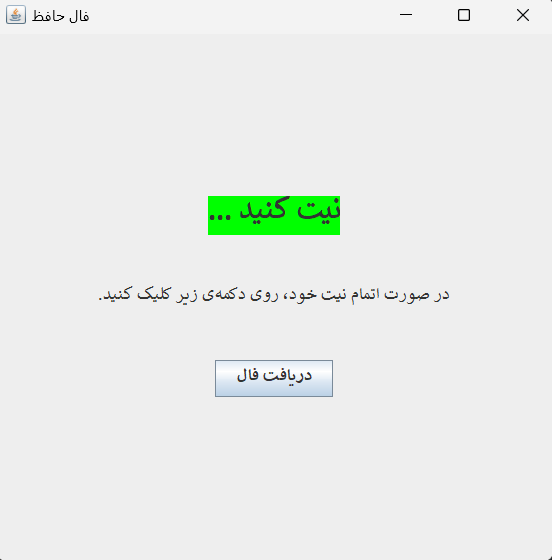
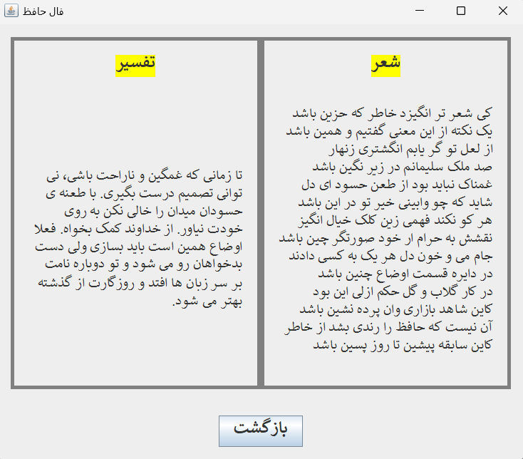

# Hafez Divination (Faal-e Hafez)

This is a Java application that provides Hafez divinations by sending an HTTP request to an API and displaying the results in a GUI. The project uses the `HttpURLConnection` for making the HTTP requests and `Jackson` for JSON parsing.

## Features

- Fetches a random Hafez poem and its interpretation from an API
- Displays the poem and interpretation in a user-friendly GUI
- Switches between the home screen and the divination result screen

## Prerequisites

- Java 8 or higher
- Maven (for dependency management)

## Dependencies

The project uses the following dependencies:
- `com.fasterxml.jackson.core:jackson-databind:2.14.2`
- `javax.swing` (for the GUI)

Make sure to include the Jackson library in your project. If you're using Maven, add the following to your `pom.xml`:

```xml
<dependency>
    <groupId>com.fasterxml.jackson.core</groupId>
    <artifactId>jackson-databind</artifactId>
    <version>2.14.2</version>
</dependency>
```

## Installation And Usage

1. Clone the repository:
   ```sh
   git clone https://github.com/ykazemim/hafez-divination.git
   ```
2. Navigate to the project directory:
   ```sh
   cd hafez-divination
   ```
3. Compile and run the application:
    ```sh
    javac Main.java
    java Main
    ```

4. The GUI window will open. Follow the instructions on the screen to get a Hafez divination.

**Note:** This application only works in Persian.

## Contributing

If you would like to contribute to this project, please fork the repository and submit a pull request. For major changes, please open an issue to discuss what you would like to change.

## Screenshots





## Assignment

This project was originally created as an assignment for the Advanced Programming course at _Amirkabir University of Technology (AUT)_.
